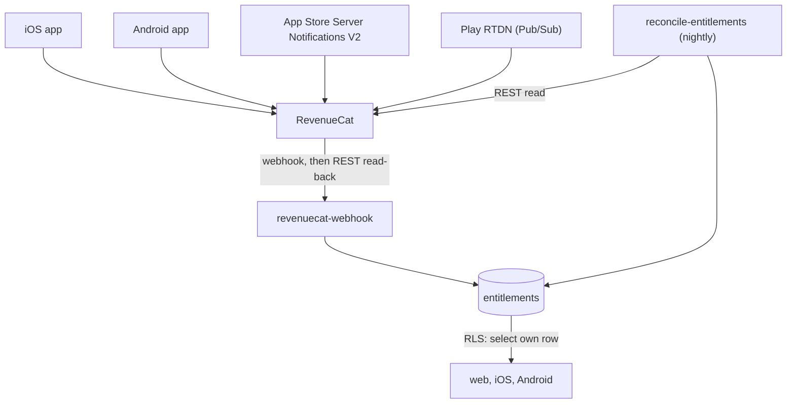

# Entitlements

How a purchase becomes access to FABTrades Pro, and why the server owns the answer.

## The one idea worth holding onto

A purchase is one way to **acquire** access. Access itself is a row in Postgres keyed
by Supabase `user_id`.

Everything else follows from that separation. Buy on iOS, get Pro on Android and the
web. Refunds and lapses take access away by the same path they granted it. And a
support question — "why does this person have Pro?" — has one place to look, rather
than three stores to interrogate.

Both Apple and Google permit this. What they do not permit is collecting money
outside their systems on their platforms, which is a different question.



## Tables

| Table | Holds | Written by |
| --- | --- | --- |
| `entitlements` | One row per user: current access | Service role only |
| `billing_events` | Raw provider events, keyed by event id | Service role only |

`entitlements` has exactly one policy: `select` where `auth.uid() = user_id`. There
is no insert, update, or delete policy, so a client can read its own access and
change nobody's. A client that could write `is_active` could grant itself Pro.

`billing_events` has RLS enabled and **no** policies, which leaves it reachable only
by the service role. Nobody's purchase history is any client's business, including
their own — the state a client needs is in `entitlements`.

### Why one row of state, not a ledger

`entitlements` holds *current* state, and the webhook overwrites it wholesale. That
choice is load-bearing:

- Store events arrive **out of order**. A renewal can land before the expiry it
  replaces.
- Events mean less than their names suggest. A refund arrives as a `CANCELLATION`,
  and a billing failure looks like an expiry until it recovers.
- Deliveries repeat. RevenueCat retries until it gets a 200.

Folding a stream like that into a boolean drifts, and the drift is invisible until a
customer complains. So the webhook does not trust the event body for state at all —
it re-reads the whole customer from RevenueCat and overwrites the row. That is
idempotent by construction: applying the same event twice, or two events in the wrong
order, converges on the same answer.

`billing_events` is the ledger, and it exists for two reasons: its primary key gives
idempotency, and a disputed charge is argued from what the provider actually said.
The mapping into `entitlements` is lossy by design, and this is the only place the
discarded detail survives.

## The webhook

`supabase/functions/revenuecat-webhook`, in order:

1. **Check the shared secret** in the `Authorization` header. Otherwise the URL is
   the only thing protecting an endpoint that grants paid access, and URLs leak. The
   comparison is constant-time.
2. **Record the event** in `billing_events`, keyed by RevenueCat's event id. Already
   recorded means a replay: return 200 without doing anything else, so a redelivery
   burst does not become a burst of RevenueCat API calls.
3. **Read current state** from `GET /v1/subscribers/{app_user_id}`.
4. **Overwrite the `entitlements` row** and return 200.

Failures return 5xx, because that is what makes RevenueCat retry — the retry is the
repair path. Anything unprocessable returns 2xx or 4xx to *stop* the retries: an
unparseable body, a missing event id, or an `app_user_id` that is not one of ours will
not succeed on the tenth attempt either. A missing secret returns 503 for the same
reason.

If the entitlement write fails, the handler deletes the event it just recorded before
returning 500. Without that, the retry would recognise its own event as a replay and
acknowledge it — leaving a paying customer on `free` with nothing left to notice,
because a purchase that never landed has no row for reconciliation to find.

### Identity binding is the linchpin

The client calls `Purchases.logIn(supabaseUserId)` immediately after Supabase
sign-in, so every webhook's `app_user_id` **is** the Supabase UUID and the row can be
written without a lookup table.

The corollary: **gate the paywall behind sign-in.** An anonymous purchase creates a
RevenueCat customer with no Supabase identity, and reattaching it afterwards is manual
support work. Events whose `app_user_id` is not a UUID (RevenueCat's
`$RCAnonymousID:…`) fall back to `original_app_user_id`, and if that is not one of
ours either, the event is recorded and ignored.

### Sandbox

Sandbox purchases are indistinguishable from real ones in every other field, so
`is_sandbox` is recorded — a test purchase in production should be visible rather than
mistaken for revenue.

RevenueCat also excludes sandbox and StoreKit-test transactions from
`GET /subscribers` unless the request sends `X-Is-Sandbox: true`. Without it a sandbox
delivery resolves to "no purchase" and does nothing, which is very hard to read as a
sandbox-only problem. The webhook sets the header when the event says
`environment: SANDBOX`.

## Nightly reconciliation

`supabase/functions/reconcile-entitlements`, called by
`.github/workflows/reconcile-entitlements.yml` at 05:00 UTC.

Webhooks are the fast path and cannot be the only path:

- A delivery can exhaust its retries during an outage.
- An **expiry is a non-event**. Nothing fires when a subscription simply lapses.

Either leaves a customer with the wrong access and nothing to notice. So once a night,
re-read state for everyone whose row is about to matter: active subscribers whose
`expires_at` falls between seven days ago and 36 hours from now. Looking back a week
covers a late-recorded renewal or a retried card; looking ahead covers a renewal that
should be seen as a renewal rather than a lapse. Keeping the set that small is what
makes a full sweep of every user unnecessary.

Rows with no `expires_at` — lifetime unlocks and promotional grants — never appear,
which is correct: nothing about them changes on a clock.

A row is written only when something actually moved, compared across every derived
column rather than just the tier. A renewal moves only `expires_at`, and skipping that
write would leave the row permanently stale: still inside tonight's window, still
skipped, every night after. Leaving untouched rows alone keeps `updated_at` meaning
"when this last changed" rather than "when a job last ran".

One unreachable customer does not abandon the sweep; failures are collected and
reported, and the run exits non-zero so the scheduled job goes red with the successful
work already committed.

## Configuration

Secrets live in Supabase, not in the repo:

```bash
supabase secrets set \
  REVENUECAT_WEBHOOK_SECRET=<any long random string> \
  RECONCILE_SECRET=<a different long random string> \
  REVENUECAT_API_KEY=sk_<secret key from RevenueCat> \
  REVENUECAT_ENTITLEMENT_ID='FABTrades Pro'

supabase functions deploy revenuecat-webhook
supabase functions deploy reconcile-entitlements
```

Both functions have `verify_jwt = false` in `supabase/config.toml`. RevenueCat sends
the shared secret above, not a Supabase JWT, so with gateway verification on every
delivery would 401 — the secret check inside the function is what replaces it. It is
declared in config rather than passed as `--no-verify-jwt` so that a deploy which
forgets the flag cannot silently break billing.

`REVENUECAT_API_KEY` must be a **secret** key (`sk_…`). The publishable key the apps
use returns nothing useful from `/subscribers`.

In the RevenueCat dashboard, under **Integrations → Webhooks**, point the URL at
`https://<project>.supabase.co/functions/v1/revenuecat-webhook` and set the
Authorization header to `Bearer <REVENUECAT_WEBHOOK_SECRET>`.

Two repository secrets drive the nightly job:

| Secret | Value |
| --- | --- |
| `SUPABASE_FUNCTIONS_URL` | `https://<project>.supabase.co/functions/v1` |
| `RECONCILE_SECRET` | Same value as the Supabase secret above |

The workflow holds only `RECONCILE_SECRET`. The RevenueCat key and the service-role
key stay in Supabase, so a leak in Actions cannot read the database or the billing
account.

## Testing

The logic is separated from its I/O so it can be tested without a Postgres, a
RevenueCat account, or a network:

| File | Holds | Tested by |
| --- | --- | --- |
| `_shared/entitlement.ts` | RevenueCat customer → row mapping | `entitlement_test.ts` |
| `revenuecat-webhook/handler.ts` | Secret check, replay detection, failure handling | `handler_test.ts` |
| `reconcile-entitlements/reconcile.ts` | Who is due, what counts as changed | `reconcile_test.ts` |
| `*/index.ts` | Wiring only — no decisions | Not tested |

```bash
cd supabase/functions
deno task check   # fmt, lint, type check, test
```

CI runs the same checks whenever anything under `supabase/` changes.

The mapping tests are where the judgement calls are pinned down, and they are worth
reading as documentation: a grace period keeps access, an intro price is not a trial,
a refund revokes access before `expires_date` says it should, and an absent
`expires_date` means lifetime rather than expired.

## Reading entitlements from a client

Not yet wired up — that is the `client-billing` step. When it is, both clients read
this table through a single accessor (`entitlementProvider` on mobile,
`useEntitlement()` on web) so premium features flip in one place.

The intended pattern is two layers: RevenueCat's `CustomerInfo` for instant
post-purchase UI, and `entitlements` as the server-side source of truth. The first
avoids a spinner while a webhook lands; the second is what actually decides.

Web stays read-only premium at launch: it reads the same row and points at the app to
subscribe. Do **not** put a purchase link in the iOS build without the StoreKit
External Purchase Link entitlement, which carries US-storefront-only gating and
15-day transaction reporting.
